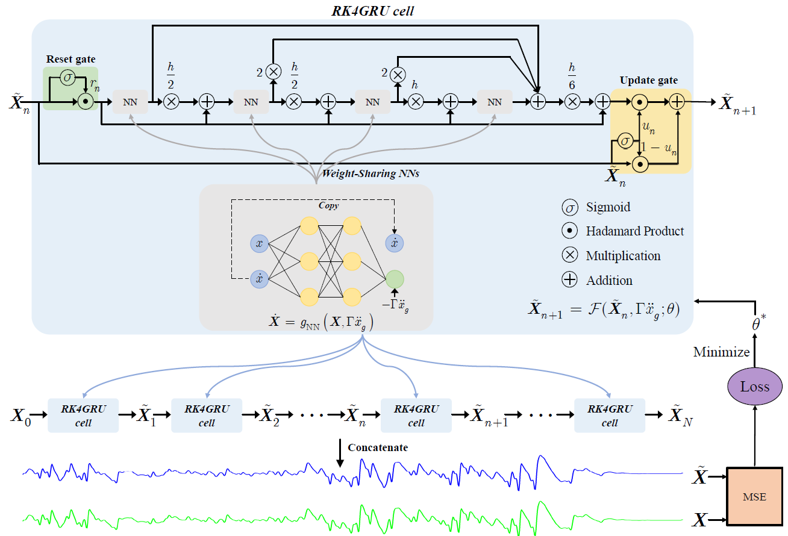

# State space model-based Runge-Kutta gated recurrent unit networks for structural response prediction
This repository contains codes and data for the following publication:
*!!!!!!!!!!!!!
## Abstract
Seismic analysis of structural systems often relies on numerical methods, such as the finite element method, for dynamic response prediction. Establishing a high-fidelity numerical model becomes challenging when structural parameters are unknown, and the increasing complexity of numerical models requires prohibitively heavy computation, especially for large engineering problems exhibiting nonlinear hysteretic behaviors. Data-driven black-box modeling methods describe the input-output relationship without relying on precise physical assumptions, but this leads to difficulty in learning interpretable latent spaces of dynamic systems. In recent years, the modeling approach of incorporating physics into machine learning for dynamical systems has emerged as a mainstream trend. In this study, a novel state space model-based recurrent neural network (RNN) embedded with physics is proposed, which integrates Gated Recurrent Unit (GRU) networks and the Runge-Kutta method as its framework, named the RKGRU network. A progressive training strategy with three stages was adopted during the network training process. Three examples are presented to illustrate the capability of the RK4GRU networks to model different structural behaviors, including a linear numerical system with three degrees of freedom (three-DOF), a nonlinear single degree of freedom (SDOF) numerical system with Bouc-Wen hysteresis and an actual overpass with on-site monitoring data. Compared to state-of-the-art physics-enhanced modeling networks, the RKGRU networks exhibit superior performance, requiring fewer training samples and achieving higher prediction accuracy for long trajectories. Additionally, inspired by the transition equations of the state space vectors, the recurrent weight-sharing neural networks (NNs) embed the physical mechanisms of variable equality as hard constraints. The weight-sharing NNs can be flexibly designed based on prior physics knowledge of different structures.



## Contains
***Code*** contains code of RK4GRU for the Bouc-Wen model <br>


## Citation
Please cite the following paper if you find the work relevant and useful in your research:
```
!!!!!!!!!!!!!!!!!
```
